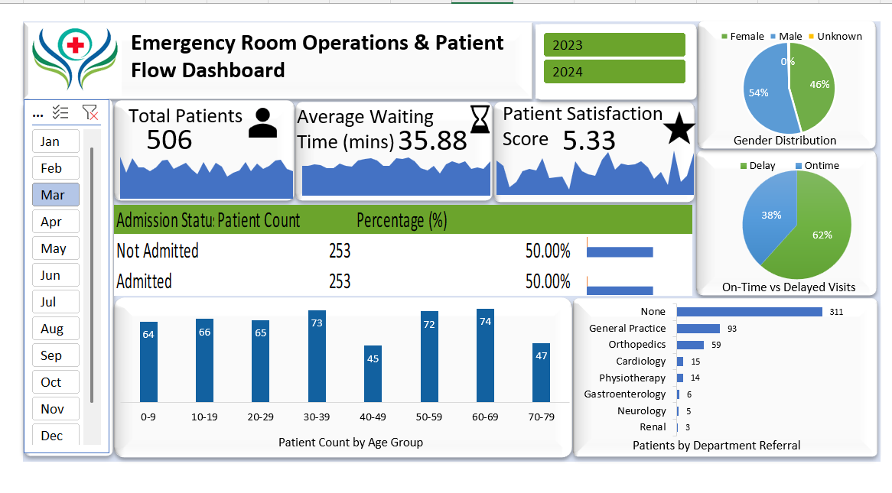

# 🏥 Emergency Room Operations Dashboard – Data Analysis & Insights

  
  

**Project Type:** Healthcare Data Analytics & Interactive Dashboard  
**Tools & Technologies:** SQL, Excel (Power Query, Power Pivot, DAX, Dashboard)  
**Domain:** Hospital Operations / Emergency Room Analytics  

---

## 📊 Project Overview

This project demonstrates **end-to-end hospital data analysis** to optimize **Emergency Room (ER) operations**. I designed an **interactive Excel dashboard** to help hospital management:

- Monitor patient flow and wait times  
- Track key operational KPIs  
- Improve patient satisfaction through actionable insights  

It’s a perfect showcase for **data cleaning, modeling, visualization, and operational analytics skills** — exactly what recruiters look for in a data analyst intern.  

---

## 🎯 Key KPIs & Insights

| KPI | Description |
|-----|-------------|
| **Total Patients** | Number of ER visits in a specific period |
| **Average Wait Time** | Average patient waiting time before seeing a doctor |
| **Patient Satisfaction Score** | Daily patient satisfaction ratings |

**Analytical Deep-Dives:**  
- **Daily Trends:** Peak hours, weekly & seasonal patterns (Area Charts)  
- **Patient Demographics:** Age Group (10-year brackets) & Gender distribution  
- **Admission Status:** Admitted vs Not Admitted  
- **Timeliness:** Patients attended within 30 minutes  
- **Department Referrals:** Departments referring most patients to ER  

**Key Insights:**  
- Identified busiest days to optimize staffing  
- Highlighted delays >30 minutes in specific departments  
- Enabled interactive drill-down by **Year, Month, and Department**  

---

## 🛠️ Technical Stack & Skills Demonstrated

- **SQL:** Extract, clean, deduplicate, and transform raw hospital data  
- **Excel (Power Query):** Merge datasets, build **custom Calendar Table**  
- **Excel (Power Pivot & DAX):**  
  - Age Grouping, Wait Time Categorization  
  - Advanced KPI calculations  
- **Excel Dashboard:** Interactive charts, slicers, drill-down navigation  

**Skills Highlighted:**  
- Data cleaning & preprocessing  
- Time-series and demographic analysis  
- KPI definition and visualization  
- Interactive dashboard creation for decision-making  

---

## 🗂️ Repository Structure

[Emergency-Room-Operations-Patient-Flow-Dashboard](./)

[SQL Query.sql](./SQL%20Query.sql) – SQL script to clean & preprocess hospital data  
[Dashboard.xlsx](./Dashboard.xlsx) – Interactive Excel Dashboard workbook  
[Hospital ER_Data - Raw Data.csv](./Hospital%20ER_Data%20-%20Raw%20Data.csv) – Raw ER dataset  
[Dashboard.png](./Dashboard.png) – Dashboard screenshot  
[LICENSE](./LICENSE) – MIT License  
[README.md](./README.md) – Project documentation

---

## 🔄 Data Pipeline

**1️⃣ SQL Processing**  
- Removed duplicates & handled nulls  
- Standardized gender & admission status  
- Pre-calculated age groups & wait time statuses  

**2️⃣ Excel Modeling**  
- Built continuous Calendar Table for time-series accuracy  
- Defined relationships between Calendar Table & hospital dataset  
- Applied DAX formulas for age brackets & wait status  

**3️⃣ Dashboard Visualization**  
- Slicers for **Month / Year / Department**  
- Area charts for daily patient trends  
- Pie & bar charts for demographics & admissions  
- KPI summary overview  

---

## 🏁 How to Use

1. Run SQL script `SQL Query.sql` for data preprocessing  
2. Open the Excel dashboard `Dashboard.xlsx`  
3. Use slicers & navigation buttons to explore KPIs & trends  

---

## 💡 Impact & Value Delivered

- Streamlined **patient flow monitoring** in ER  
- Identified bottlenecks to **reduce wait times**  
- Provided **actionable insights** for staffing & patient satisfaction  
- Demonstrated **end-to-end data analytics skills** for healthcare operations  

---

## 📌 Future Enhancements

- Integrate **real-time ER data feeds**  
- Predict patient volumes using **machine learning**  
- Include **financial and resource utilization metrics**  

---

## 📸 Dashboard Preview

  
*Figure 1: Interactive ER Dashboard Overview*  

---

## 📝 Portfolio Summary

>  Hospital ER Dashboard using SQL and Excel. Cleaned, modeled, and analyzed patient data to track **wait times, admissions, and satisfaction**. Built an **interactive dashboard** providing actionable insights for hospital operations and patient flow optimization.
